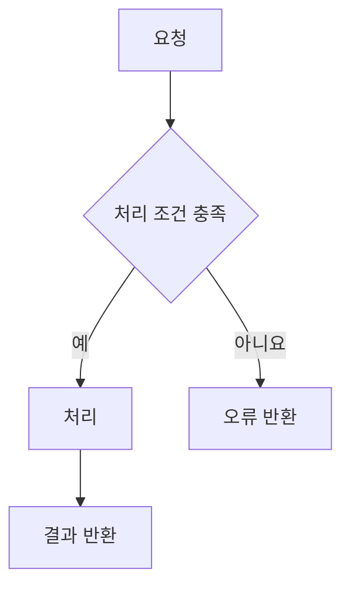

## 🔗 연관된 이슈
<!-- 이슈 번호 입력. 예: #12 -->
<!-- 이슈가 완전히 해결되었다면 아래에 예약어 작성 -->
- closed #이슈번호

## 🎯 의도

## 📝 작업 내용

### 📌 요약

### 🔍 상세

## 🔄 동작 흐름
<!-- Mermaid로 변경 전후의 흐름 또는 사용자 동작 순서 작성 -->
<!-- 아래 예시를 실제 구현에 맞게 수정하고, 필요한 조건 분기와 오류 처리 포함 -->

## 📸 영상 / 이미지 (Optional)
