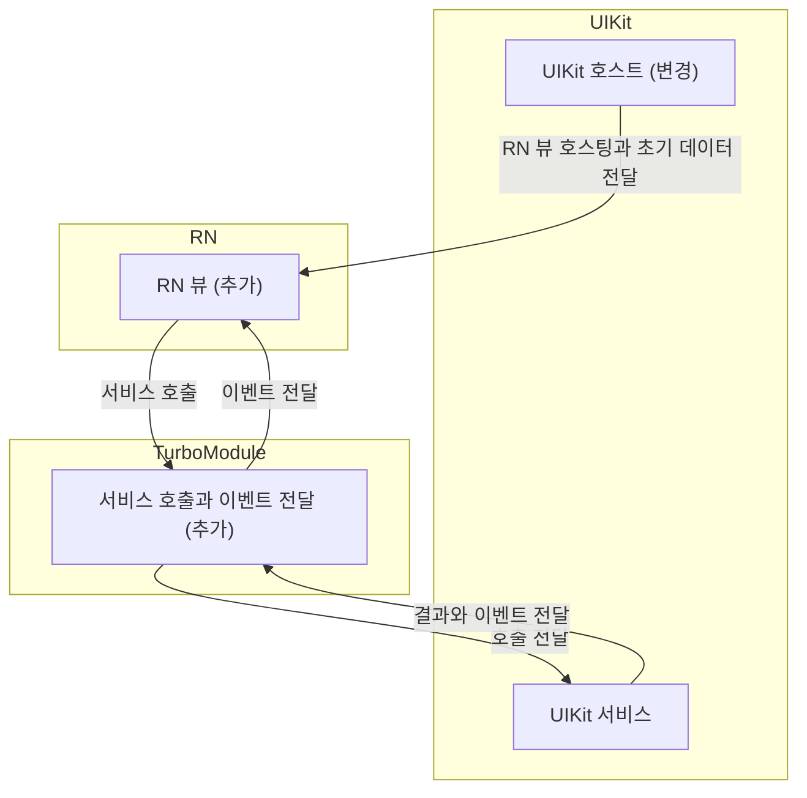
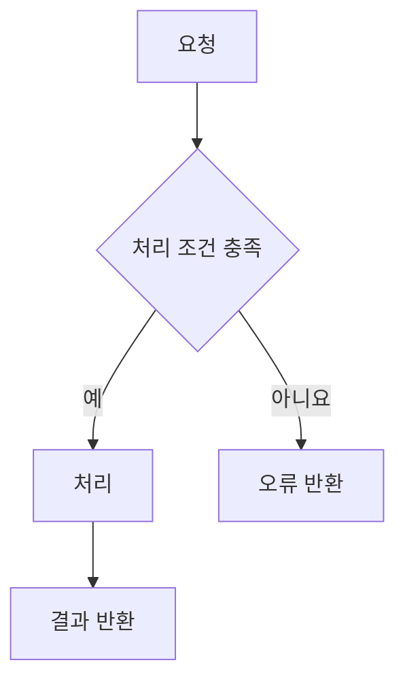

## 🔗 연관된 이슈
<!-- 이슈 번호 입력. 예: #12 -->
<!-- 이슈가 완전히 해결되었다면 아래에 예약어 작성 -->
- closed #이슈번호

## 🎯 의도

## 📝 작업 내용

### 📌 요약

### 🔍 상세

## 🔄 구조와 동작 흐름
<!-- Mermaid로 UIKit과 RN의 구조(화면 소유 계층, TurboModule 경계, 데이터와 이벤트 방향)를 먼저 그리고 이어서 변경 전후의 동작 흐름 작성 -->
<!-- 구조도는 UIKit, TurboModule, RN을 subgraph로 구분하고 이번 PR에서 추가, 변경, 제거된 요소를 노드 문구에 표시 -->
<!-- 한쪽만 변경하는 PR에서도 구조도에 상대편과의 경계 표시 -->

<!-- 구조 예시: 실제 구현에 맞게 수정 -->

<!-- 동작 흐름 예시: 변경 전후의 흐름에 맞게 수정하고 처리 조건 분기와 오류 처리 포함 -->

## 📸 영상 / 이미지 (Optional)
