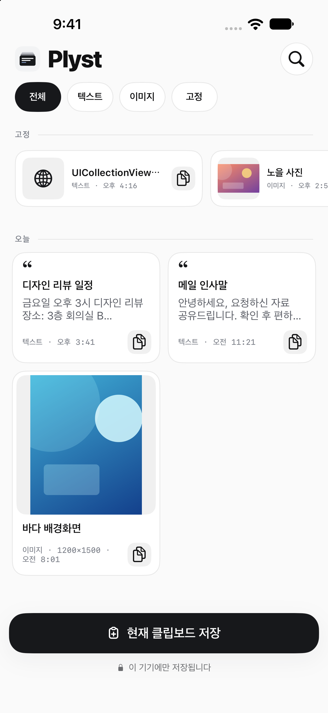
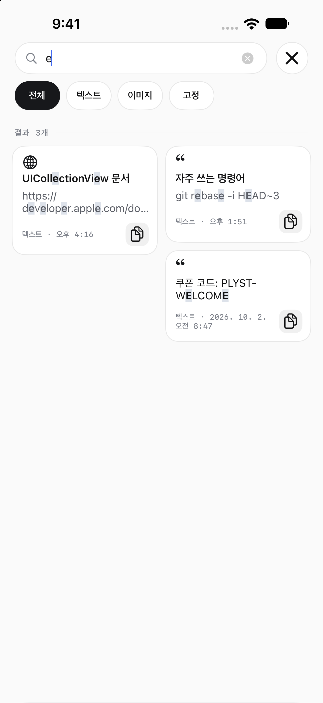
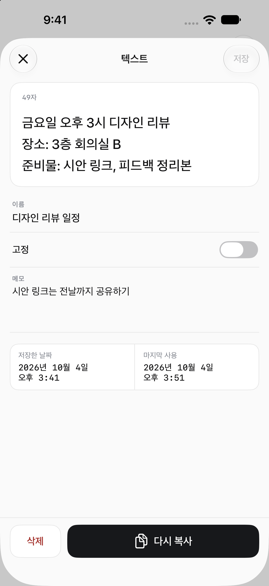
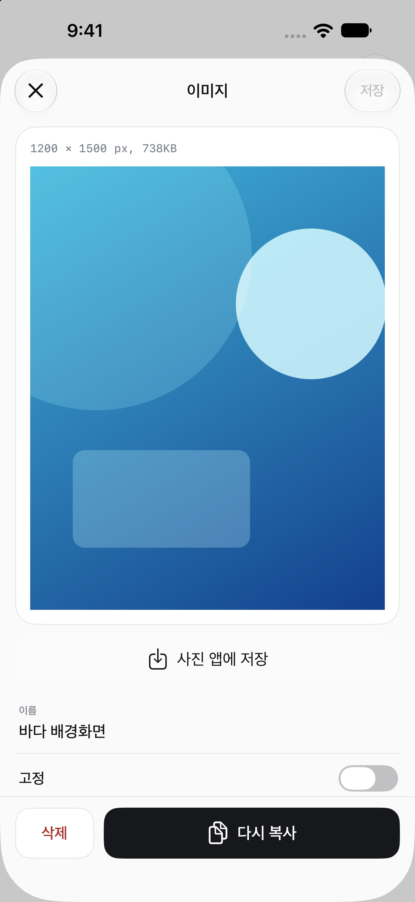
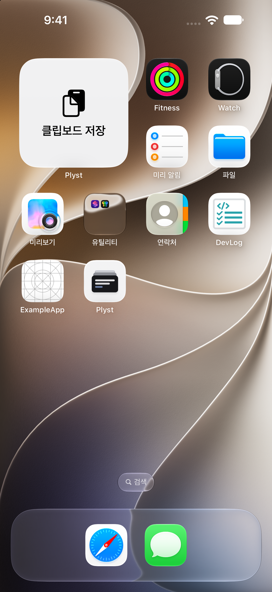
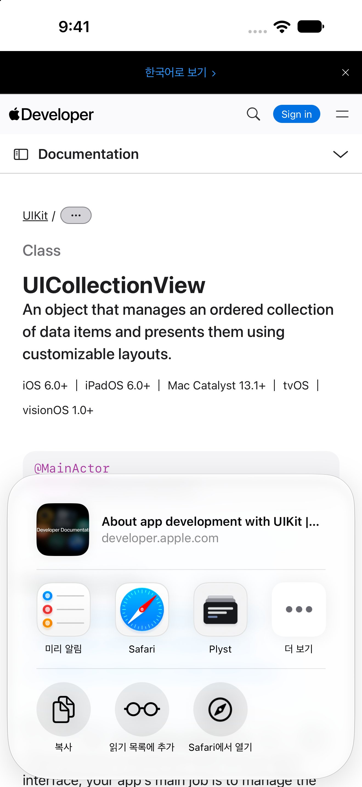
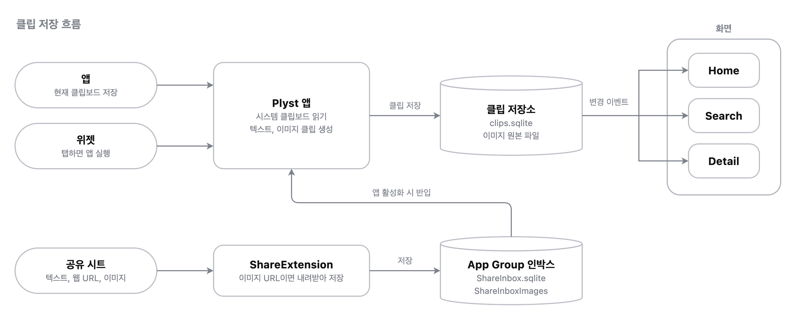

# Plyst

> 복사한 텍스트와 이미지를 한 곳에 모아 정리하고 다시 꺼내 쓰는 UIKit 기반 클립보드 보관 앱<br>
> 앱 안에서 복사한 내용뿐 아니라 위젯과 공유 시트로 들어온 내용도 하나의 클립 기록으로 관리하는 구조

| 홈 | 검색 | 텍스트 상세 |
| :---: | :---: | :---: |
|  |  |  |

| 이미지 상세 | 위젯 | 공유 시트 |
| :---: | :---: | :---: |
|  |  |  |

## 프로젝트 개요

복사한 내용은 다음 복사로 덮어써지기 쉬워 다시 쓰려는 텍스트나 이미지를 잃어버리기 쉬운 문제를 해결하기 위한 앱

복사한 내용을 클립으로 저장하고 이름과 메모, 고정 여부로 정리해 다시 검색하고 복사할 수 있도록 구성



## 주요 기능

| 화면 | 기능 |
| --- | --- |
| Home | 전체, 텍스트, 이미지, 고정 필터와 고정 클립 영역<br>현재 클립보드 저장, 클립 복사와 삭제<br>길게 눌러 고정 또는 고정 해제와 삭제 메뉴 표시<br>이미지 썸네일 비동기 로드와 캐시, 저장 결과 토스트 안내 |
| Search | 텍스트는 이름과 본문, 이미지는 이름과 저장 시각에서 대소문자 구분 없이 검색<br>이름과 본문에서 일치하는 부분 강조<br>최근 검색어 선택, 개별 삭제, 전체 삭제<br>전체, 텍스트, 이미지, 고정 필터와 클립 복사 |
| 텍스트 상세 | 이름, 메모, 고정 여부 편집과 저장<br>복사와 삭제, 저장 시각과 마지막 사용 시각 표시 |
| 이미지 상세 | 이름과 고정 여부 편집과 저장<br>이미지 표시, 복사, 삭제, 사진 앱 저장 |
| 위젯 | 탭하면 앱을 열고 클립보드 내용을 클립으로 저장 |
| 공유 시트 | 텍스트, 웹 URL, 이미지를 클립으로 저장<br>Safari 이미지 공유는 이미지 URL에서 내려받아 이미지 클립으로 저장<br>저장 실패 시 다시 시도하거나 취소 |

## 핵심 성과

### **1. 축소 디코딩으로 이미지 메모리 사용 제어**
> **문제**<br>
> 1200만 화소 사진을 원본 그대로 디코딩하면 한 장에 약 46MB의 비트맵이 생김<br>
> 이미지 목록을 빠르게 스크롤하면 메모리 한도를 넘겨 앱이 종료될 수 있음
>
> **해결**<br>
> 원본은 디스크에 두고 화면 크기에 맞춘 ImageIO 축소본만 디코딩<br>
> 썸네일은 48개까지만 보관하고 화면 밖으로 나간 셀의 로딩은 취소
>
> **성과**<br>
> • 상세 화면 비트맵 46MB → 7.3MB, 목록 썸네일 약 1MB (1200만 화소 기준 계산값)<br>
> • 원본은 재인코딩 없이 보존해 화질 유지

```swift
let thumbnailOptions = [
    kCGImageSourceCreateThumbnailFromImageAlways: true,
    kCGImageSourceCreateThumbnailWithTransform: true,
    kCGImageSourceThumbnailMaxPixelSize: maximumPixelDimension
] as CFDictionary
```

### **2. 단일 작성자 구조로 앱과 Share Extension의 DB 동시 접근 문제 해결**
> **문제**<br>
> Share Extension과 본 앱은 별도 프로세스로 실행되며 같은 App Group 저장소에 접근함<br>
> 두 프로세스가 같은 SQLite 파일에 동시에 쓰면 잠금 충돌로 쓰기가 실패할 수 있음<br>
> 본 앱이 이미지 정리를 실행하면 Extension이 저장 중이라 아직 참조되지 않은 파일을 지울 수 있음
>
> **해결**<br>
> 본 저장소는 본 앱만 쓰고 Extension은 App Group 컨테이너의 Inbox(SQLite와 이미지 폴더)에만 쓰도록 쓰기 주체를 분리<br>
> 본 앱은 활성화될 때 Inbox의 클립을 본 저장소에 확정한 뒤에만 Inbox에서 제거<br>
> Inbox 이미지의 저장과 정리 복구는 Extension만 실행하고 본 앱은 읽기와 삭제만 수행<br>
> 두 프로세스가 Inbox에 잠깐 겹쳐 접근하는 경우는 GRDB의 WAL 모드와 5초 잠금 대기로 처리
>
> **성과**<br>
> • 본 저장소에 두 프로세스가 동시에 쓰지 않는 구조<br>
> • 같은 식별자는 다시 추가하지 않아 반입을 반복해도 결과가 같음<br>
> • 반입 중 실패하거나 앱이 종료되어도 클립 유실과 중복 없음

```swift
let copied = try await copy(clip, inboxImages: inboxImages)    // 본 저장소에 먼저 확정
try await remove(clip, inbox: inbox, inboxImages: inboxImages)  // 확정된 뒤에만 Inbox에서 제거
```

### **3. 정리 후보 기록으로 파일과 DB 불일치 복구**
> **문제**<br>
> 이미지 원본은 파일로 저장하고 메타데이터는 SQLite로 저장하므로 하나의 트랜잭션으로 묶을 수 없음<br>
> 중간에 종료되면 참조 없는 파일이나 파일 없는 클립이 생길 수 있음
>
> **해결**<br>
> 원본을 쓰기 전에 정리 후보로 기록하고 메타데이터가 확정된 뒤에만 정리 후보를 해제<br>
> 다음 실행에서 남은 정리 후보 중 메타데이터가 참조하는 파일은 남기고 나머지를 정리
>
> **성과**<br>
> • 어느 단계에서 중단되어도 참조 없는 파일 없이 복구<br>
> • 저장 확정 후에만 변경 이벤트를 발행해 화면과 저장 상태 일치

```swift
let image = try files.save(data)                // 정리 후보 기록 후 원본 저장
try await storage.insert(clip)                  // 실패하면 새 원본 정리
try files.finishPending(fileID: image.fileID)   // 확정된 뒤에만 정리 후보 해제
```

### **4. `@unchecked Sendable` 없이 Swift 6 언어 모드 전환**
> **문제**<br>
> ReactorKit과 RxSwift, `NSItemProvider`처럼 `Sendable`을 보장하지 않는 API에서 데이터 경합 진단 발생<br>
> `@unchecked Sendable`로 진단을 끄면 이후 생기는 경합을 컴파일러가 잡지 못함
>
> **해결**<br>
> Reactor의 `Action`, `Mutation`, `State`를 `Sendable`로 제한하고 비동기 결과는 `@Sendable` 클로저로만 RxSwift 스트림에 연결<br>
> `NSItemProvider`는 래퍼 없이 `@MainActor`에 격리하고 콜백이 중복 호출될 수 있는 로드는 `OSAllocatedUnfairLock`으로 continuation을 한 번만 재개
>
> **성과**<br>
> • 앱과 Share Extension, Widget, 테스트 타깃 전체를 Swift 6 언어 모드로 전환<br>
> • 앱 코드의 `@unchecked Sendable`, `nonisolated(unsafe)` 0건

```swift
@MainActor
final class ClipShareItem {
    let providers: [NSItemProvider]    // Sendable이 아닌 값은 MainActor 안에서만 접근
    nonisolated let title: String?
}
```

---


## 기술 스택

| 구분 | 스택 |
| --- | --- |
| 최소 지원 버전 | iOS 17.0+ |
| 지원 기기 | iPhone |
| 언어 | Swift 6.0 |
| 화면 | UIKit |
| 앱 확장 | Share Extension, WidgetKit |
| 상태 관리 | ReactorKit, RxSwift |
| 비동기와 스트림 | async/await, `AsyncStream`(저장소 변경 이벤트), `AsyncThrowingStream`(`ReactorEffect`로 RxSwift에 연결) |
| 프로세스 간 데이터 전달 | App Group 컨테이너(공유 SQLite Inbox와 이미지 폴더), 커스텀 URL 스킴 `plyst://`(위젯에서 앱 실행) |
| 네트워크 | URLSession 임시 세션(이미지 URL 내려받기) |
| 저장소 | SQLiteData, GRDB, swift-structured-queries |
| Apple 프레임워크 | UIKit, Foundation, WidgetKit, ImageIO |
| 테스트 | XCTest |
