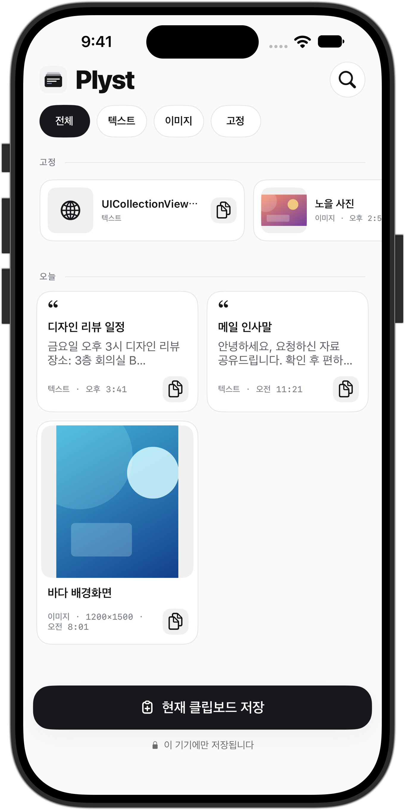
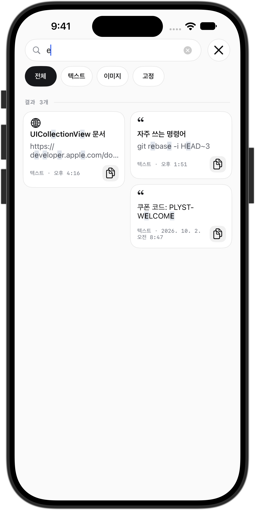
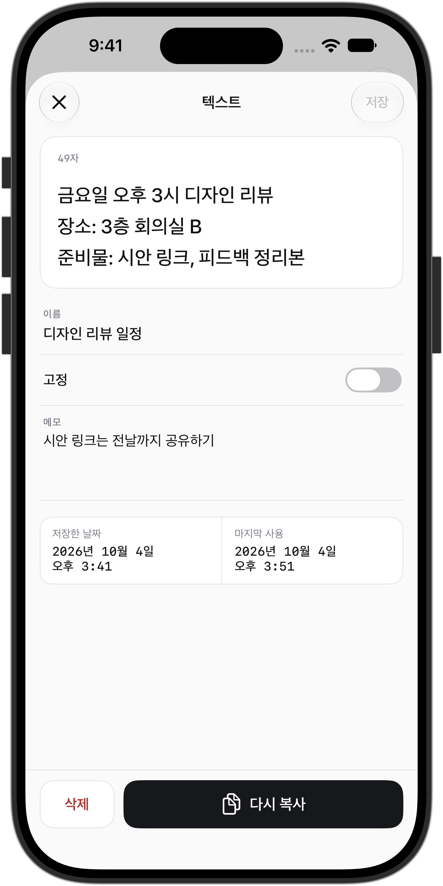
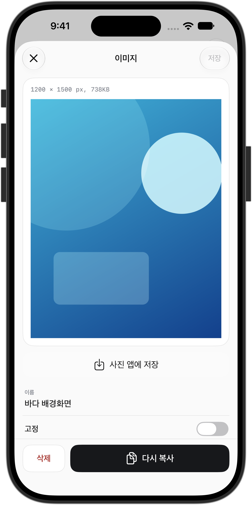
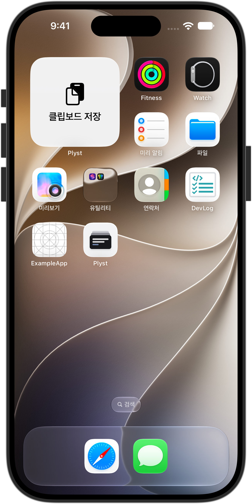
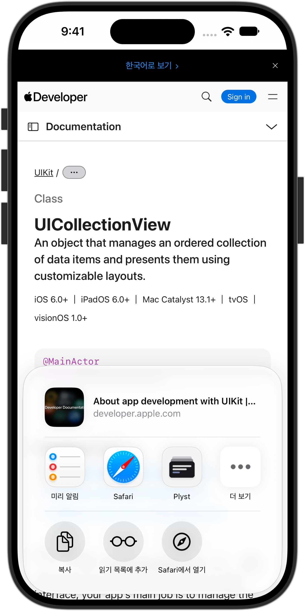
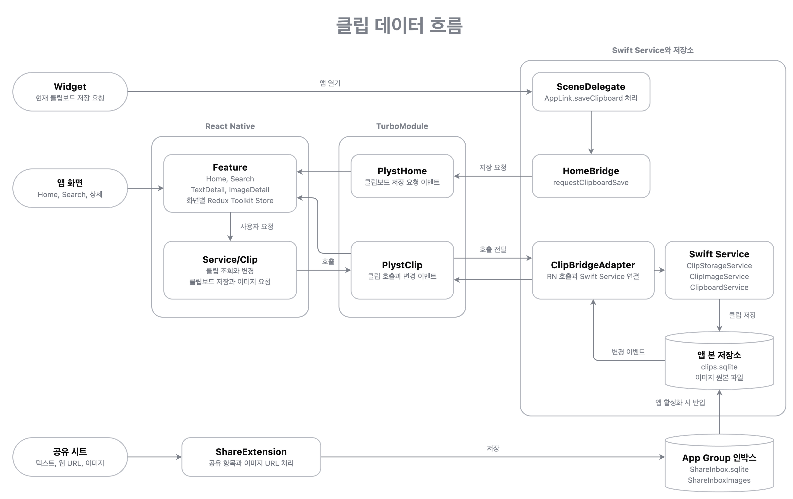
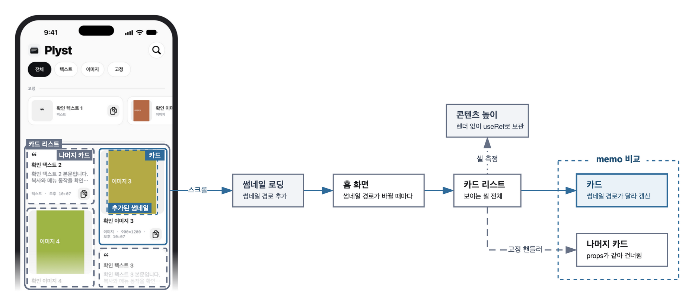

# Plyst RN

> 복사한 내용을 필요할 때 다시 꺼내 쓰는 iPhone 클립 보관함<br>
> 클립을 찾고 상세 화면에서 이름과 고정 여부를 편집하는 React Native 앱

<a href="https://github.com/opficdev/Plyst"></a>

<a href="https://apps.apple.com/kr/app/plyst/id6818818750"></a>

<table>
  <tr>
    <th width="33.3%">Home</th>
    <th width="33.3%">Search</th>
    <th width="33.3%">텍스트 상세</th>
  </tr>
  <tr>
    <td width="33.3%"></td>
    <td width="33.3%"></td>
    <td width="33.3%"></td>
  </tr>
</table>

<table>
  <tr>
    <th width="33.3%">이미지 상세</th>
    <th width="33.3%">Widget</th>
    <th width="33.3%">Share Extension</th>
  </tr>
  <tr>
    <td width="33.3%"></td>
    <td width="33.3%"></td>
    <td width="33.3%"></td>
  </tr>
</table>

## 프로젝트 개요

화면과 상태는 RN이 담당하고 iOS 실행 환경과 시스템 자원은 Swift가 담당하는 브라운필드 앱

| 영역 | 담당 | 이유 |
| --- | --- | --- |
| 화면 구성과 화면 상태, 화면 전환과 상세 시트 (Home, Search, TextDetail, ImageDetail) | RN | 시스템 자원 없이 화면에서만 사용하며 `AppRoot` 하나가 전환을 소유 |
| 검색 결과 계산과 하이라이트 | RN | `getClips()` 결과를 Rust 코어가 네이티브 스레드에서 계산 |
| 토스트 | RN | `showToast`를 JavaScript에서 직접 호출 |
| 글자 수와 접두어 계산 | RN | `Model/clipText.ts`에서 `unicode-segmenter`로 계산 |
| 이미지 용량 표시 문구 | RN | `formatByteCount`가 한국어 `ByteCountFormatter` 출력을 재현 |
| 앱과 Scene 생명주기, RN 런타임, RN 루트 호스트 | Swift | iOS 실행 환경 필요 |
| 상세 화면의 닫기, 저장 버튼 (Liquid Glass) | Swift | UIKit `UIButton.Configuration.glass()` 버튼을 Fabric 컴포넌트로 RN 상단 바에 배치 (iOS 26 미만은 평면 버튼) |
| TurboModule 구현과 wire 값 변환 | Swift | Codegen 인터페이스의 네이티브 구현 |
| 클립 저장소(SQLite), 이미지 원본과 미리보기와 썸네일 파일, App Group | Swift | 저장 무결성과 앱과 Extension 간 공유 필요 |
| 클립 정렬(`ClipSortOrder`) | Swift | Share Extension 반입 경로에서 사용 |
| `isWebLink` 판정 | Swift | Foundation `URL`과 WHATWG `URL`의 판정 차이를 재현할 수 없음 |
| 클립보드 읽기와 쓰기, `lastUsedAt` 갱신 | Swift | 시스템 API와 다른 앱과의 권한 동작에 의존 |
| 사진 저장 | Swift | RN으로 옮겨도 사진 보관함 권한 판정은 Swift에 남아 책임이 나뉨 |
| 최근 검색어의 규칙과 저장 | Swift | 대소문자 비교 결과가 달라지고 목록을 원자적으로 교체해야 함 |
| Share Extension, Widget | Swift | Extension 실행 환경 필요 |



## 주요 기능

- Home에서 클립을 종류와 고정 여부로 분류하고 현재 클립보드를 저장
- Search에서 이름, 본문, 저장 시각으로 검색하고 최근 검색어를 관리
- 상세 화면에서 이름, 메모, 고정 여부를 편집하고 저장, 복사, 삭제 (이미지는 사진 앱에 저장)
- Widget에서 앱을 열어 현재 클립보드를 저장
- Share Extension에서 텍스트, 웹 URL, 이미지를 저장

## 핵심 성과

### **1. 카드 memo 분리로 JS 스레드 작업 시간 2.62s → 1.69s 단축**



> **문제**<br>
> FlashList가 화면 상태 전체를 참조해 값 하나만 바뀌어도 보이는 카드 전체를 재렌더링<br>
> 카드마다 렌더 때 새로 만든 핸들러를 받아 바뀐 카드만 골라 렌더할 수 없는 구조
>
> **해결**<br>
> 카드는 고정 핸들러와 표시에 필요한 props만 받는 memo 컴포넌트로 분리<br>
> FlashList의 `renderItem`은 카드 props에 쓰는 값만 참조<br>
> 홈 콘텐츠 높이는 바뀌어도 렌더를 일으키지 않는 `useRef`로 보관
>
> **성과**<br>
> ✅ 홈 리스트 스크롤 기준 JS 스레드 작업 시간 **2.62s → 1.69s**<br>
> ✅ 검색 결과 리스트 스크롤 기준 JS 스레드 작업 시간 **1.99s → 1.57s**<br>
> ⚠️ 메인 스레드 작업 시간은 **변화 없음**

```tsx
const [cardHandlers] = useState<HomeCardHandlers>(() => ({
  onSelect: (clip) => handlers.current.selectClip(clip),  // 렌더마다 새로 만들지 않는 고정 핸들러
  // ...
}));

// 다른 카드의 썸네일이 바뀌어 셀이 다시 렌더되어도 이 카드의 표시 값이 같으면 렌더를 건너뜀
const HomeGridItem = memo(function HomeGridItem({ clip, now, thumbnailUri, isThumbnailFailed, handlers }) {
  // ...
});
```

| 측정 조건 | 값 |
|:---:|:---:|
| 기기 | iPhone 18 Pro 시뮬레이터, iOS 27.2 |
| 빌드 | Release |
| 데이터 | 이미지 50개 리스트 |
| 이동 | 리스트를 2회 왕복 스크롤 |
| 횟수 | 변경 전후 각 3회 평균 |

### **2. Redux Toolkit Listener로 종료된 화면의 상태 갱신 차단**
> **문제**<br>
> 화면 컴포넌트가 `useReducer`와 `useEffect`로 상태 변경, Service 호출, 이벤트 구독을 함께 처리<br>
> 화면을 닫은 뒤에도 구독과 비동기 요청이 남으면 종료된 화면의 상태를 갱신할 수 있음
>
> **해결**<br>
> 화면마다 Store를 만들고 `createSlice`로 State와 Action을 정의하고 `listeners.ts`에 Service 호출과 구독을 분리<br>
> `dispatch(textDetailActions.nameChanged(name))`처럼 Action 생성자를 호출해 문자열 `type`을 직접 쓰지 않음<br>
> 화면 마운트의 `start()`와 해제의 `dispose()`에서 Listener를 끊고 요청 큐와 구독을 한 곳에서 정리
>
> **성과**<br>
> ✅ Home, Search, TextDetail, ImageDetail 화면 컴포넌트에서 **Service 호출과 이벤트 구독 제거**<br>
> ✅ Action 이름과 payload의 오타를 **컴파일에서 검출**<br>
> ✅ 해제된 화면의 Listener는 `signal`이 abort된 뒤 `dispatch`하지 않아 **종료된 화면의 비동기 결과가 새 화면에 반영되지 않음**<br>
> ✅ 이미 시작한 저장과 복사의 결과 토스트는 **별도 호스트에서 계속 표시**<br>
> ✅ **렌더링 없이** Store와 Listener를 Jest로 검증

```ts
export const textDetailSlice = createSlice({
  name: 'textDetail',
  reducers: {
    nameChanged(state, { payload }: PayloadAction<string>) {
      if (state.phase === 'loaded') state.draft.name = payload;
    },
    // ...
  },
});

listen({
  actionCreator: textDetailActions.save,
  effect: async (_, api) => {
    const result = await saveTextDetail(clipID, draft);
    if (!api.signal.aborted) api.dispatch(textDetailActions.saved(result.clip));
    // ...
  },
});
```

### **3. Codegen TurboModule로 RN의 저장소 직접 접근 차단**
> **문제**<br>
> RN과 Swift가 호출 형식을 따로 정의하면 한쪽만 바뀌어도 호출이 어긋날 수 있음
>
> **해결**<br>
> PlystClip, PlystHome의 Codegen 인터페이스와 PlystDetailBarButton 컴포넌트로 RN 호출과 Swift 구현 연결<br>
> RN 결과물과 브리지를 XCFramework로 묶어 PlystReactNative 패키지로 앱에 연결
>
> **성과**<br>
> ✅ RN 의존성에 **SQLite, 파일 시스템, 클립보드 모듈 없음**<br>
> ✅ 모든 데이터 호출과 이벤트 전달이 **같은 Codegen 인터페이스를 거치는 구조**

```ts
export interface Spec extends TurboModule {
  readonly onClipChange: CodegenTypes.EventEmitter<ClipChange>;  // Swift에서 RN으로 변경 이벤트 전달
  getClip(id: string): Promise<ClipRecord | null>;               // RN에서 Swift 저장소 조회
  getClips(): Promise<ClipRecord[]>;
  // ...
}
```

---

## 기술 스택

| 구분 | 스택 |
| --- | --- |
| 최소 지원 버전 | iOS 17.0+ |
| 지원 기기 | iPhone |
| 언어 | TypeScript 6.0.3, Swift 6.0 |
| 화면 | React Native 0.86.3, React 19.2.3, Expo 57.0.27, FlashList 2.3.3, expo-image 57.0.5 |
| 앱 확장 | Share Extension, Widget Extension |
| 상태 관리 | Redux Toolkit 2.13.0, React Redux 9.3.0 (RN 화면)<br>ReactorKit 3.2.0, RxSwift 6.10.2 (Share Extension 상태 관리) |
| 네이티브 브리지 | TurboModule, Codegen |
| 앱 통합 | React Native Brownfield 5.3.0, XCFramework |
| 저장소 | SQLiteData 1.12.0, GRDB 7.11.1, swift-structured-queries 0.39.2 |
| Apple 프레임워크 | UIKit, Foundation, WidgetKit, SwiftUI, ImageIO, Photos |
| 테스트 | Jest 29.7.0, XCTest |
| 자동화 | GitHub Actions, fastlane |
